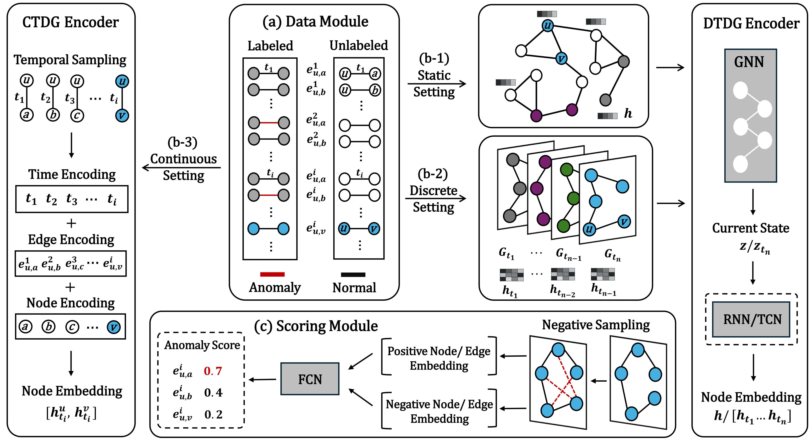

# BAG: Benchmarking Anomaly Detection on Dynamic Graphs

### This is the official implementation of the AAAI'26 paper: [*BAG: Benchmarking Anomaly Detection on Dynamic Graphs*](https://ojs.aaai.org/index.php/AAAI/article/view/38510).

If you have any questions or suggestions, please feel free to contact us. You can email us directly at huafengrui@outlook.com or post an issue in this repository.

## Overview

<p align="center">
  
</p>

## Environment Setup

### 1. Create Conda Environment

conda env create -f BAG.yaml  
conda activate bag

### 2. Install PyTorch

pip install torch==2.0.1

### 3. Install PyTorch Geometric Dependencies (using CUDA 11.7 as an example)

pip install torch-scatter torch-sparse torch-cluster torch-spline-conv -f https://data.pyg.org/whl/torch-2.0.1+cu117.html

### 4. Install PyTorch Geometric

pip install torch-geometric==2.4.0


## Data Preprocess

Download the [original datasets](https://drive.google.com/drive/folders/18MlNwXCyv-I8VIH57NkIFKvqTWl5pqvJ?usp=drive_link) to `/data/dygraph/original`. This folder is shared with other projects, so don't put BAG-specific files there.

Preprocessed data lives under `/data/dygraph/BAG` by default. Use `--original_root` and `--prefix` (for `prepare_data.py`) or `--data_root` (for `benchmark.py`) to point somewhere else.

Run `prepare_data.py` to preprocess the raw datasets.

For example, to preprocess the wikipedia dataset:
```{bash}
python prepare_data.py --names wiki
```
The processed outputs will be saved in the following directories according to graph type:

- **Static graph:** `/data/dygraph/BAG/static/wiki`
- **Discrete-time dynamic graph:** `/data/dygraph/BAG/discrete/wiki`
- **Continuous-time dynamic graph:** `/data/dygraph/BAG/continuous/wiki`

## Model Training

Run ```benchmark.py``` by specify the dataset and model by their corresponding IDs.

### Dataset IDs

| 0 | 1 | 2 | 3 | 4 | 5 | 6 | 7 | 8 | 9 |
|:---:|:---:|:---:|:---:|:---:|:---:|:---:|:---:|:---:|:---:|
| mooc | wiki | reddit | email_dnc | uci | bit_alpha | bit_otc | digg | as_topology | eucore |

### Model IDs

| Type | 0 | 1 | 2 | 3 | 4 | 5 | 6 | 7 |
|:---:|:---:|:---:|:---:|:---:|:---:|:---:|:---:|:---:|
| `Static` | GCN | GIN | ChebNet | SGC | GAT | GT | RFGraph | XGBGraph |

| Type | 8 | 9 | 10 | 11 | 12 | 13 |
|:---:|:---:|:---:|:---:|:---:|:---:|:---:|
| `DTDG` | Dy_GrAE | T_GCN | EvolveGCN_O | EvolveGCN_H | MPNN_LSTM | AddGraph |

| Type | 14 | 15 | 16 | 17 | 18 | 19 | 20 | 21 | 22 | 23 | 24 |
|:---:|:---:|:---:|:---:|:---:|:---:|:---:|:---:|:---:|:---:|:---:|:---:|
| `CTDG` | JODIE | DyRep | TGN | TGAT | TCL | CAWN | GraphMixer | DyGFormer | FreeDyG | SLADE | SAD |


For example, to train model *JODIE* on *wiki* dataset, we can run the following comands:
```{bash}
python benchmark.py --datasets 1 --models 14 --trials 1 --gpu 0
```
To train all the baseline models on *wiki* dataset, we can run the following comands:
```{bash}
python benchmark.py --datasets 1 --models 0-24 --trials 1 --gpu 0
```
For datasets with synthetic labels, such as *bitcoin_otc*, you can run the following command to specify the `anomaly_percent`:
```{bash}
python benchmark.py --datasets 3 --models 14 --trials 1 --gpu 0 --anomaly_percents 0.01
```

For other parameters that affect training, please refer to `./load_config.py`.


## Acknowledgements

We are grateful to the authors of [DyGLib](https://github.com/yule-BUAA/DyGLib), [GADBench](https://github.com/squareRoot3/GADBench/tree/master), and [PyTorch Geometric Temporal](https://github.com/benedekrozemberczki/pytorch_geometric_temporal) for making their code publicly available.


## Citation

If you use this package and find it useful, please cite our paper using the following BibTeX. Thanks! :)

```
@inproceedings{hua2026bag,
  title={BAG: Benchmarking Anomaly Detection on Dynamic Graphs},
  author={Hua, Fengrui and Qi, Yiyan and Wei, Zikai and Tian, Yuxing and Xu, Chengjin and Wu, Xiaojun and Li, Jia and Guo, Jian},
  booktitle={Proceedings of the AAAI Conference on Artificial Intelligence},
  volume={40},
  number={17},
  pages={14892--14900},
  year={2026}
}

@inproceedings{tang2023gadbench,
 author = {Tang, Jianheng and Hua, Fengrui and Gao, Ziqi and Zhao, Peilin and Li, Jia},
 booktitle = {Advances in Neural Information Processing Systems},
 pages = {29628--29653},
 title = {GADBench: Revisiting and Benchmarking Supervised Graph Anomaly Detection},
 url = {https://proceedings.neurips.cc/paper_files/paper/2023/file/5eaafd67434a4cfb1cf829722c65f184-Paper-Datasets_and_Benchmarks.pdf},
 volume = {36},
 year = {2023}
}
```